# Dragon Ball Z: Budokai Tenkaichi 3 (Wii) Reverse Engineering Guide

## Table of Contents
- [Prerequisites](#prerequisites)
- [Required Software](#required-software)
- [Background Information](#background-information)
- [Getting Started](#getting-started)
- [Setting Up Debug Environment](#setting-up-debug-environment)
- [Debugging and Reverse Engineering](#debugging-and-reverse-engineering)


## Prerequisites

Basic C programming knowledge is required. While you don't need to be an expert, you should understand the following concepts:

- Variables and data types
- Logical operators
- Conditional statements
- Loops
- Functions
- Pointers

Basic assembly knowledge is required when debugging the game's instructions.

## Required Software

(Feel free to download them as you go along, as some steps might not be needed)

1. [Ghidra](https://ghidra-sre.org) 11.2.1 for code decompilation
2. Dolphin 5.0 for game emulation, extracting game file and improved debug mode
3. [Dolphin Memory Engine](https://github.com/aldelaro5/dolphin-memory-engine)

## Background Information

### DOL Files
A DOL file (.dol) is the main executable format used by Nintendo GameCube and Wii consoles. Named after the GameCube's development codename "Dolphin," these files function similarly to .exe files on Windows computers. DOL files contain the compiled game code and can be up to 7MB in size for Wii games. They serve as the primary program that runs the game, handling essential functions like loading game assets and managing memory.

> **Note**: Always backup DOL files before modification as they are crucial to the game's operation.

### Assembly Language
Assembly language is a low-level programming language that corresponds directly to machine code instructions. It typically results from compiling high-level code into platform-specific format.

### BT3 Wii Assembly Language
BT3 Wii uses PowerPC Gekko assembly language, which was standard for GameCube systems with IBM Gekko processors. The Wii's IBM Broadway processor maintains backward compatibility with this instruction set.

## Getting Started

### Extract the DOL File from the ISO

1. Select the game in the Dolphin browser menu, right-click and select "Properties"
2. Go to the "Filesystem" tab (on the far right)


3. Right-click the Disc on top and select "Extract entire Disc..." and extract the content to a folder (Don't extract it in the Git folder, this is your testing environment)
4. Navigate to `DATA/sys/` in the extracted folder to find `main.dol` - this is the game's code we'll be working with


### Setting up Ghidra

1. Set up Ghidra Gamecube Binary Loader

   - Ghidra doesn't include Wii language decompilation by default, you need to get it [here](https://github.com/Cuyler36/Ghidra-GameCube-Loader/releases). Do not follow any of the instructions in the repo, (it's a lie and it will cost you precious time) instead, download the .zip file and move it under `Extension/Ghidra/` with all the other .zip extensions that came in by default.

   - Once you do that, you can install that extension (don't worry about it being red) and you will have this option when importing the .dol file.

      

      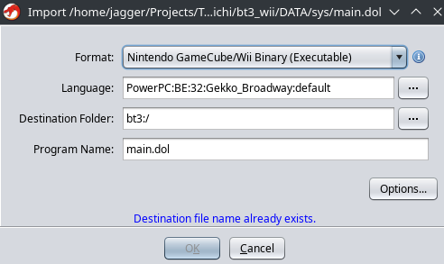

2. Import and export Ghidra files

   - Due to how Ghidra handles user-specific paths and permissions within the project files, we need to import and export the project as an archive file (.gar)
   - To import in Ghidra via: 
      - Select File > Restore Project
      - Select "BT3 rollback.gar" as the Archive File
      - Select a directory outside of the git folder for the Restore Directory (this will be your Ghidra workspace)

      

   - Select main.dol. You should now see this:

      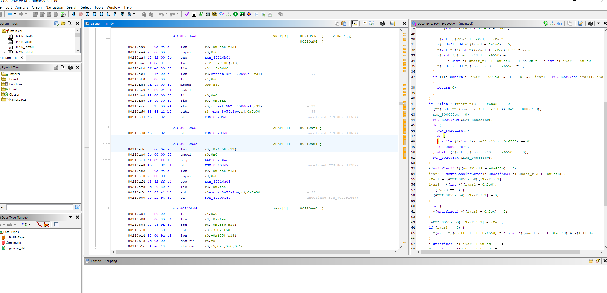

   - To export the project after you made any sort of editing:
      - Select File > Archive Current Project 
      - Make sure to name it "BT3 rollback.gar" and in the same directory so it rewrites to update.

   > **Note:** Ghidra is stupid sometimes, it will show you a value that seems different from the code you see in dolphin that's being run. But most of the time it is because it shows it incorrectly:
   >  -  Instead of `0x8056`, it shows `-0x7faa` in the same address and same instruction. This is because:
   >     - -0x7faa in binary: 1000 0000 0101 0110
   >     - 0x8056 in binary:  1000 0000 0101 0110
   >  - Some values are actually equivalent in binary so be careful

## Setting Up Debug Environment

### Dolphin Debug Mode

1. In Dolphin's toolbar, select "Options > Configuration"
2. Under the "Path" tab:
   - Click "Add" and select your extracted game folder
   - Ensure "Search Subfolders" is checked
3. Dolphin should now recognize the extracted game that we will use to debug with, in this case the 0,00 B* one.


4.	Once again on the tool bar, select “Options>Configuration”.
5.	Under the “Interface” tab, check “Show Debugging UI”.
6.	Then in “View” show all the following.

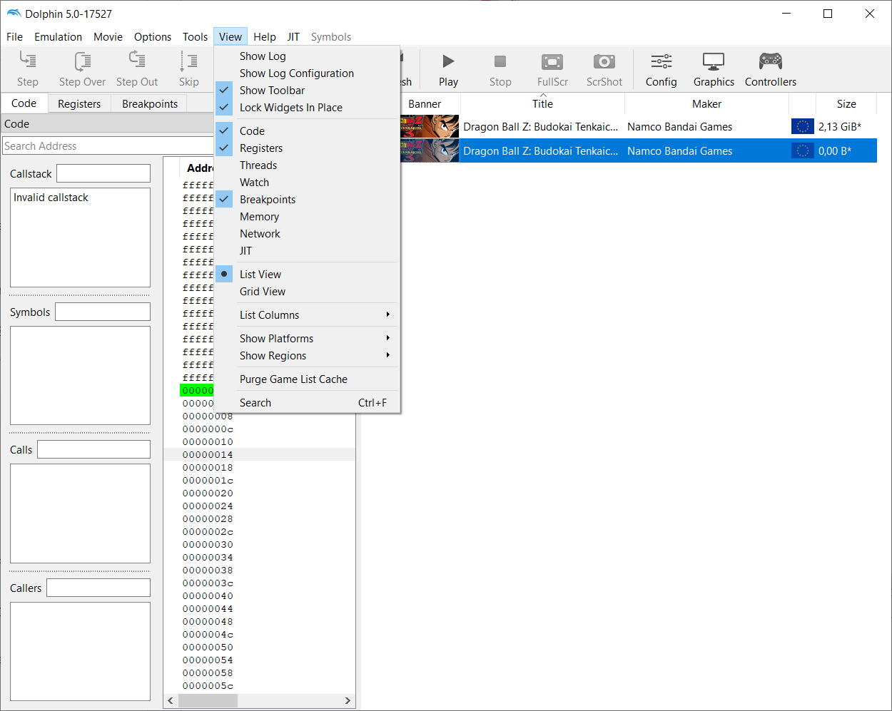

7.	Now we have debug mode!

> **Tip**: Enable "Boot to Pause" under "Options" to catch code that executes at startup

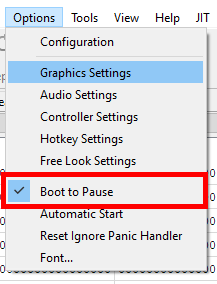

### Dolphin Memory Engine Setup

1. Clone and build from [this GitHub repository](https://github.com/aldelaro5/dolphin-memory-engine)
   - follow “How to Build”
      > **Windows Build Note**: If you encounter the CRT_SECURE warning, add `#define _CRT_SECURE_NO_WARNINGS` at the beginning of the offending code.

      - Build in Release mode for better performance
      - Find the executable at `Source\bin\Release\dolphin-memory-engine.exe`

      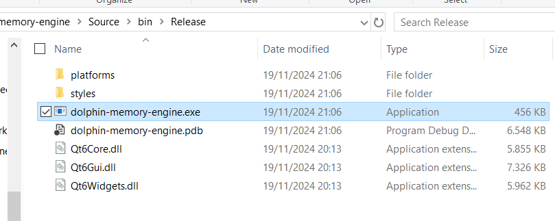

      - If you use Linux or OSX you probably know what you’re doing and how to fix them but just in case, feel free to mention any problem and add them here

2. Run alongside Dolphin debug mode for complete debugging environment

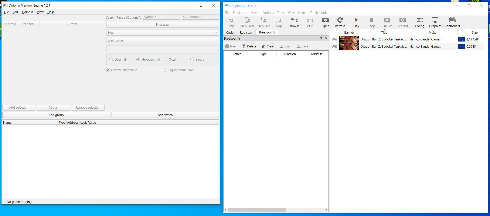

## Debugging and Reverse Engineering

### Overview

The reverse engineering process combines three main tools:
- Dolphin's debug menu for code execution control
- Dolphin Memory Engine for memory monitoring
- Ghidra for code analysis and documentation

### Core Workflow

1. **Code Investigation**
   - Set breakpoints at key locations using Dolphin's debug menu
   - Monitor code execution through stepping commands
   - Identify critical code paths during specific game events

2. **Memory Analysis**
   - Track memory changes using Dolphin Memory Engine
   - Label important memory addresses
   - Save memory watch groups (.dmw files)

3. **Documentation**
   - Document findings in Ghidra through function renaming and commenting
   - Map out key systems:
     - Dragon net battle menu
     - Duel mode logic
     - Fighting game logic
     - Game rendering
     - Sound call system
     - Input handling

!!! Will be continuing the document, currently making example by watching memory address in main menu to figure out: menu functions, target menu pointer address and hopefully some input handler function

### Example Workflow (In Progress)

1. **Planning Phase**
   - Plan what you want to do. Going in without having an idea about what you’re trying to do will not yield any result.
   - For this example I plan to figure out the code of the main menu, specifically some form of target menu address pointer. Obviously the game has to store which menu I want to enter, I can most likely assume that moving the selection up and down in the main menu will change some kind of value to indicate that. I’ll be looking for that.
   - Once I figure that out it should be much easier to figure out where everything is, since we will know at the very least which part of the instruction code corresponds to the menu of that mode.

2. **Save State Preparation**
   Create a save state at the main menu for quick testing

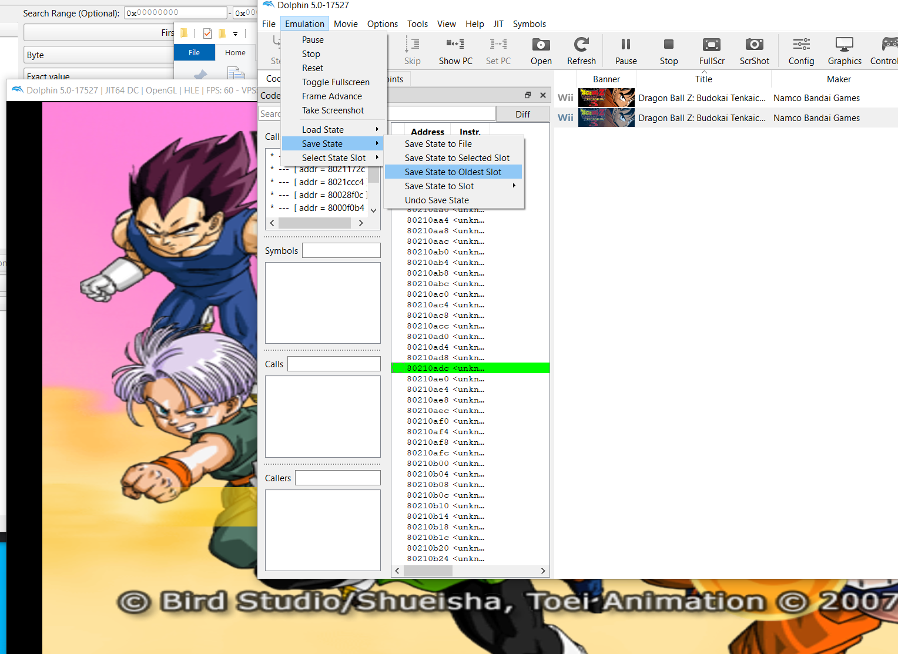

3. **Start and Try**
   - I begin by just entering the main menu and hit pause to see what codes are running

   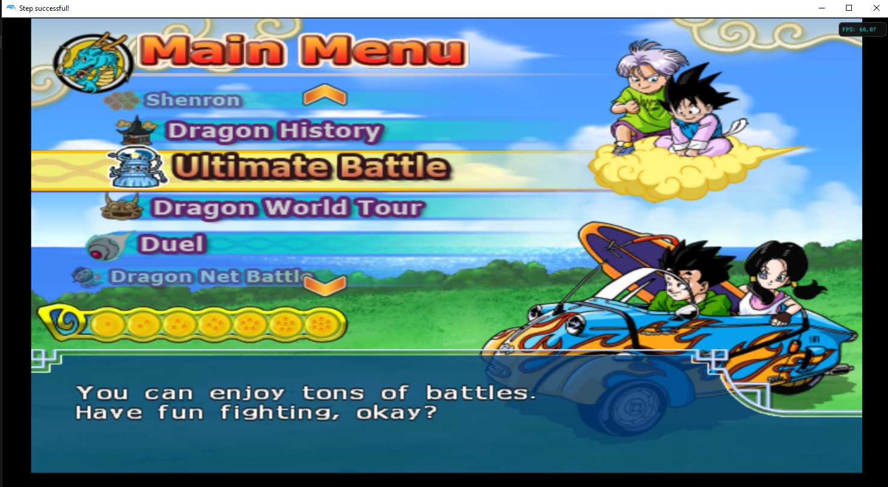

   >**Tip:** Rejoice, we live in an era where we can ask specific instruction pattern and get answer from LLMs (ChatGPT and the likes) to easily analyze parts of a list of instruction. Feel free to do so!
 
   - When I start pressing Step, the instruction would execute and continue. The current **Processing Cycle (PC)** is highlighted in green, as I do so I realized that the instructions are looping within the three instruction marked in red.

   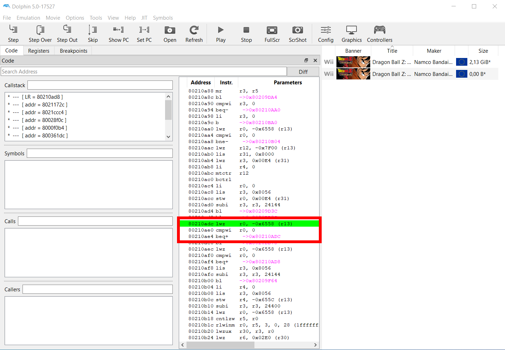

   ```
   80210adc lwz r0, -0x6558 (r13)   # Loads a word from memory address (r13 - 0x6558) into r0
   80210ae0 cmpwi r0, 0             # Compares r0 with 0
   8021ae4 beq+ ->0x80210ADC        # Branch if equal (r0 == 0) back to the first instruction
   ```

   -  This is a loop:
   1. First, it loads some value from memory (offset -0x6558 from whatever r13 points to) into r0
   2. Then it compares that value with 0
   3. If the value is 0, it branches back to the start (note the branch target 0x80210ADC matches the address of the first instruction)

   - Next to find out what's in memory address `r13 - 0x6558`
      - Luckily we can just copy the address number by right-clicking the parameter and select "Copy target address", we get 0x8062ADC8
      - Just to be safe let's actually get the value to make sure I didn't mess up
         - Going to Register, under r13 I find `80631320`
         - `0x80631320 - 0x6558 = 0x8062ADC8`

   - We then watch the memory in the address through Dolphin memory engine
      - Select "Add watch" and input the address value
      - Here's hoping this is some form of input flag, I labeled the memory as `????input buffer` 
      - > This is a bit of guess work: Since I saw that the instruction loop is 3 instructions, it's safe to assume no complex logic is being done here. In fact there isn't any logic here since it's only making a comparison between 0 and a value.

         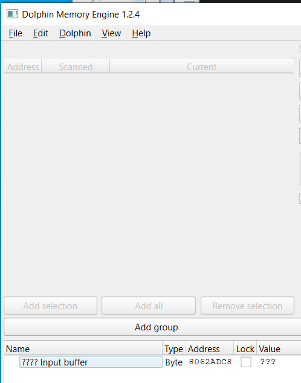

   - To test it out, I resumed the game's program by pressing "Play" on the emulator and started to press up and down to see what changed.
   - It didn't change and just stayed 0, so it's not input related. If it was some kind of input buffer the value would have changed

4. **Analyze the problem**
   - So the naive hope didn't pan out, time to look for other hypothesis.
   - There are many things that I can do from here: 
      - Try another guess (with the value staying at 0 didn't give me many option though)
      - Resume and pausing and game to see if there are any other code that happen
      - Look for memory changes
      - etc.
   - I've decided to just play pause the game repeatedly to see if there are any changes.
   - > Considering the game did in fact run and I can move in the menu, it is impossible that the loop goes on forever and the value is actually 0. It's just that I couldn't see the changes.
   - Something new happened:
   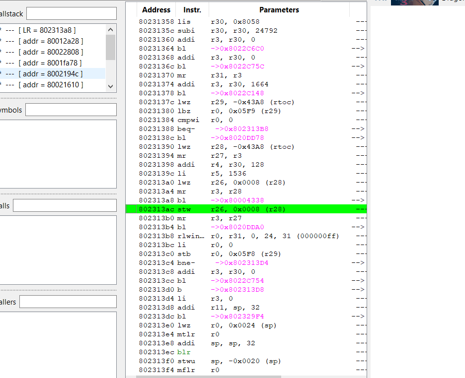
   - New hypothesis: The memory in `0x8062ADC8` is changing really fast that the polling rate of the memory didn't catch it.
   - The memory engine have different update rates set, one for watcher displaying it on the engine menu, one for the actual memory browser scanner.
   - Right-click the watched value, I can select "Browse memory at this address"
      - This window should show up
      
   - Immediately I noticed something: Since this window  updates the scanned value faster (changes highlighted in red) I can actually see that `0x8062ADC8`'s value actually did change, very fast and it does change.
      - from `0x0` to `0x80`, which is actually a very important value, `0x80` is 128 in decimal.
   - It's a value switching between 0 and 128 (0x80) that's being repeatedly checked in a loop, this is most likely a semaphore or flag being used for synchronization!
   - Actually, with the help of ChatGPT and cross referencing with Wii documentation: a memory address in the `0x806xxxxx` range on the Wii, that's typically in the operating system/IOS memory range.
   - So the 3 instruction loop is most likely just a hardware status sync check of some form, meaning going back to the initial 3 instruction loop can be assumed as some form of hardware sync check and what happens afterwords is the actual game instructions.
   - I can label this memory as `??IOS_SyncFlag_80_0` for the moment and try to determine the rest of the instructions after this 3 instruction sync check.

5. **Dolphin Memory Watch File**
   - Dolphin memory engine has a way to open and save memory address watch list.
   - For the sake of not having to keep relabeling memory and easily check through different section of the game, we can save the current watch list as a file and later open them under `File > Save` or `File > Open`.
   - Save and open this file under [this directory](/DMW/) and follow the [labeling-rule](/DMW/label-rule.md) for easy understanding.

6. **Following the code**
   - At certain points I will have to simply follow the instruction path and not just using "Step" or repeatedly "Pause" and "Play" since eventually it will be a bit too luck based.
   - For this scenario I will attempt to follow the original 3 instruction loop and see what happens from there and record as many memory address that gets read or written until I either:
      - circle back to a loop (a safe assumption to make since in this situation in some way the Processing Cycle always returns back to the `8021ADC`, processing address) or
      - I recorded enough memory address that I can try to see the changes in the memory engine again, or
      - if somewhere down the line I got lost in the huge pile of code.
   - At this point I'm going to be looking at Ghidra's decompilation window from time to time to make things easier for me, I can simply copy the address of the current Processing Cycle address find the same code address in Ghidra.
      - In Ghidra by pressing the **G** key we can bring up a search that can take us directly to an address instead of scrolling up and down.
      
   - With any luck, I could simply look at the decompiled code and hopefully intuit what the code does.
   > **Warning:** Do not change any values in Ghidra. If you see some incorrectly interpreted values as shown before, do not change it. Ignore it for now and only use Ghidra as a tool to see if there are anything you can recognize in the code in terms of logic.
   - So I'm currently in some kind of hardware syncing process, so looking at the decompiled code here probably isn't that helpful, let's instead follow the code in Dolphin debug mode and record any memory address we find.
   - Here we can see outside of the loop `beq+  ->0x80210ADC` we have an instruction `bl	->0x8020DD78` that takes us quite far into the game's code, in fact the immediate after portion of this code also could leads into somewhere quite close to that location `bl	->0x8020DD8C` (after jumping  back from `beq+	 ->0x80210AD8`)

      

      - also there doesn't seem to be anything else that looks like it's worth watching so nothing to add to the memory watch list.

   - Let's check out what's in `0x8020DD78`, simply right-click and select `follow branch` to begin the adventure.
   
      